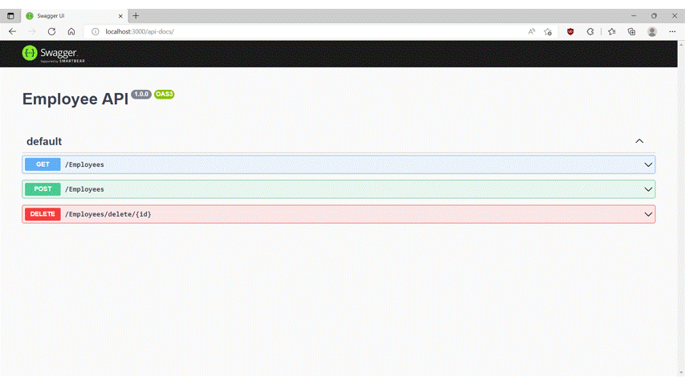

# nodejs-express-exercise

> Run a nodejs app using express library, openapi (with **swagger-jsdoc**), jsonwebtoken, and mongodb in minikube. This could be part of **MERN** stack (Mongo, Express, React, and Nodejs). In this setup, **swagger-jsdoc** allows developers to document schemas and operations via **@openapi** annotation, for example see file `employee-app/routes/employee.js`;

```
  /**
   * @openapi
   * components:
   *   securitySchemes:
   *     bearerAuth:
   *       type: http
   *       scheme: bearer
   *       bearerFormat: JWT
   *   schemas:
   *     employee:
   *       title: Employee record
   *       required:
   *       - id
   *       - name
   *       type: object
   *       properties:
   *          id:
   *             type: integer
   *          name:
   *             type: string
   */

  /**
   * @openapi
   * /Employees:
   *   get:
   *     description: Get all Employee
   *     responses: 
   *       200:
   *         description: Success
   *         content:
   *           application/json:
   *             schema:
   *               type: array
   *               title: List of Employee records
   *               items:
   *                 $ref: '#/components/schemas/employee'
   *            
   *       400:
   *         description: Fail
   *       401:
   *         description: Unauthorized
   *     security:
   *       - bearerAuth: [ ]
   */
   routes.get('/Employees', [jwt.verifyToken], async function (req, res, next) { 

      const employees = database.listAllEmployees();
      // the returning object is a promise
      employees.then((resolve) => {
        res.json(resolve);
      }).catch((error) => {
        res.status(400).send(error.message);
      });  

  });
```

> As shown above, the annotation represents one operation for one path in OpeAPI V3 schema, and the function underneath that annotation is what got assigned to that operation. This particular call we secure the route by using `[jwt.verifyToken]` code. This particular code will check if the request has valid authorization token. See snippet from `common-jwt-mod/index.js` below;

```
    verifyToken: function (req, res, next) {
      let token = req.get("Authorization");
      if (token) {
        token = token.substring(7);
      }
          
      if (!token) {
        return res.status(401).send({
          message: "Unauthorized!"
        });
      }
    
      jwt.verify(token, secretToken, (err, decoded) => {
        if (err) {
          return res.status(401).send({
            message: "Unauthorized!"
          });
        }
        req.userId = decoded.id;
        req.roles = decoded.roles;
        next();
      });
    }

```

> Example of mongo client code, when user perform a get to http://localhost:5000/Employees, the system will call **database.listAppEmployees()** function, which fetch data from a mongo db database. See below code snippets from `employee-app/database.js`;

```
  listAllEmployees: function() {
    
    return dbConnection
      .collection('employee')
      .find({})
      .limit(50)
      .toArray();
      
  },
```

## Setup mongo in minikube

> This app requires a mongo instance, here we setup one in minikube

```
kubectl apply -f mongodb/mongodb.yaml
```

### Notes to run this project locally

> During coding, to run some integration tests, we need to set the mongo connection string which is set as **ATLAS_URI** environment variable. See `employee-app/bin/server`;

```
function onListening() {
  const connectionString = process.env.ATLAS_URI;
  database.init(connectionString);

  var addr = server.address();
  var bind = typeof addr === 'string'
    ? 'pipe ' + addr
    : 'port ' + addr.port;
  debug('Listening on ' + bind);
}
```

> On windows set the ATLAS_URI

```
set ATLAS_URI=mongodb://<username>:<password>@192.168.1.240:32000
```

> On linux export the ATLAS_URI

```
export ATLAS_URI=mongodb://<username>:<password>@192.168.1.240:32000
```

> In addition, since we secured the api using JWT, below steps are also needed to setup JWT 

```
export SECRET_TOKEN=dGhpcy1pcy1teS1zZWNyZXQta2V5Cg==
```

> Then you start two projects, on one terminal start employee-app and on another one start security-svc

```
npm start
```

> Withouth a valid Json Web Token, all requests will get `401 - Unauthorized!`. To get an authorization, you must create a user and sign in with that user. The **http://localhost:4000/users/signin** endpoint will responds for a valid request with a token that we can use.

```
curl -X POST -H 'Content-type: application/json' -d '{"username": "bob", "password": "secret123", "email":"bob@test.com", "roles":["USER"]}' http://localhost:4000/users/signup | jq
```

```
curl -X POST -H 'Content-type: application/json' -d '{"username": "bob", "password": "secret123"}' http://localhost:4000/users/signin
```

## Start an express project from scratch

> This app originally was created using express-generator. If you want to start from scratch, here are the steps  

### 1. Install express framework

```
npm install express --save
```

### 2. Create a new express app using express-generator without view codes

```
npx express-generator --no-view --git employee-app
```

### 3. Install and Run

```
cd employee-app
```

```
npm install
```

```
npm start
```

## Test and coverage

> I managed to code some automated tests in this repo using Jest and Supertest frameworks. I coded these tests by following along these videos - [Unit Testing in Javascript|Writing Automated Tests With Jest](https://www.youtube.com/watch?v=hz0_q1MJa2k&list=PL0X6fGhFFNTd5_wsAMasuLarx_VSkqYYX). For example, see below snippet from `employee-app/__test__/app.test.js`, where we test the GET /Employees operation;

```
...
const listAllEmployees = jest.fn();
...
test('GET /Employees should responds with 200 code', async () => {
    listAllEmployees.mockResolvedValue([]);
    const response = await request(app).get('/Employees');
    expect(response.statusCode).toBe(200);
});
```

> One thing to highlight from above is **listAllEmployees.mockResolvedValue([])**, where we mock our mongo db object in this test to return an empty array. The function is mocked using Jest with this code **listAllEmployees = jest.fn()**. See below to run all of the tests;

```
npm test
```

> And to see the tests coverage result, open **./coverage/lcov-report/index.html** using a browser

## Deploy to minikube

> After done coding, we deploy to a minikube instance

### 1a. On separate terminal start port forwarding for pushing image to minikube

```
kubectl port-forward --namespace kube-system service/registry 5000:80
```

### 1b. Build and push the image

```
podman build -t localhost:5000/employee-app:0.0.1 .
```

```
podman push localhost:5000/employee-app:0.0.1
```

### 2. Deploy to minikube

```
kubectl apply -f Deployment
```

## Test with curl

### 1. List all employees

```
curl -H 'Authorization: Bearer <TOKEN>' $(minikube service employee-svc --url)/Employees | jq
```

### 2. Add one employee, Robert
```
curl -X POST -H 'Content-type: application/json' -H 'Authorization: Bearer <TOKEN>' -d '{"id": 3,"name": "Robert"}' $(minikube service employee-svc --url)/Employees | jq
```
### 3. Verify
```
curl -H 'Authorization: Bearer <TOKEN>' $(minikube service employee-svc --url)/Employees | jq
```
 
### 4. Delete one employee, Robert
```
curl -X DELETE  -H 'Authorization: Bearer <TOKEN>' $(minikube service employee-svc --url)/Employees/delete/3 | jq
```
### 5. Verify
```
curl -H 'Authorization: Bearer <TOKEN>' $(minikube service employee-svc --url)/Employees | jq
```
 
## Or Test with the swagger ui

> Or you can test with the swagger ui by opening **http://localhost:5000/api-docs** in a browser and interact with it

<p align="center"></p>

## Expose api in json format

> API spec in json format can be accessed by opening  **http://localhost:5000/api-docs.json**
